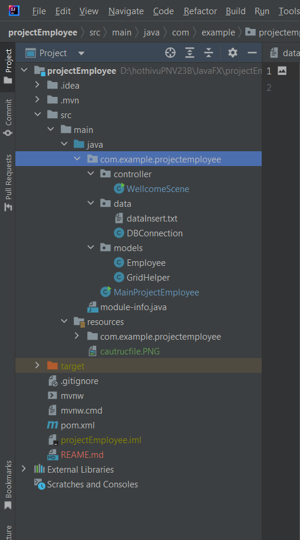

- Cấu trúc dự án: ;
- Entity Relationship Model (ERM) của database:;
- Các chức năng đã làm được :
    + Kết nối database
    + Thêm, sửa, xóa, reset và có tạo 2 scene
- Chức năng em đang làm:
    + tạo button để trở lại màn hình đâu tiên
    + Chỉnh lại màn mình đầu tiên
- Chức năng em sẽ tạo là: 
    + Tạo relationship giữa 3 bảng để có thể hiện thị hết thông tin từ 3 bảng
- Chức năng em thấy tâm đắc đó là: Khi em bắt đầu làm chức năng thì em chức ăng xóa trước, 
  đầu tiên em dùng câu lệnh remove nhưng mỗi lần chạy xóa được nhưng nó không đúng luồng đi, 
  sau khi tìm hiêu và hỏi các bạn thì em dùng câu lệnh clear.
- Lịch sử commit, do bị lỗi github nên em sử dụng 2 cái git,: 
    + ,
    +  git có tên là:projectEmployeeJavafx là git bài cuối để nộp.
